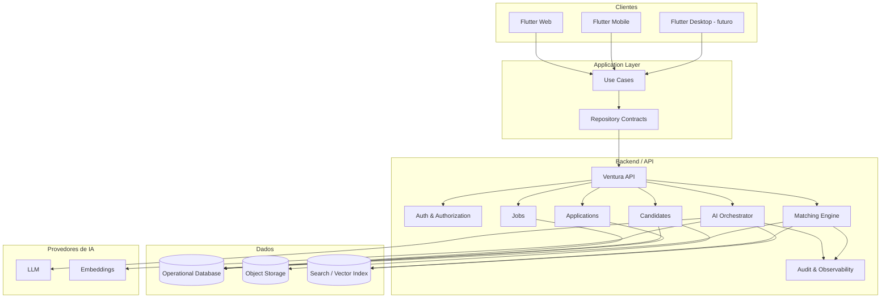
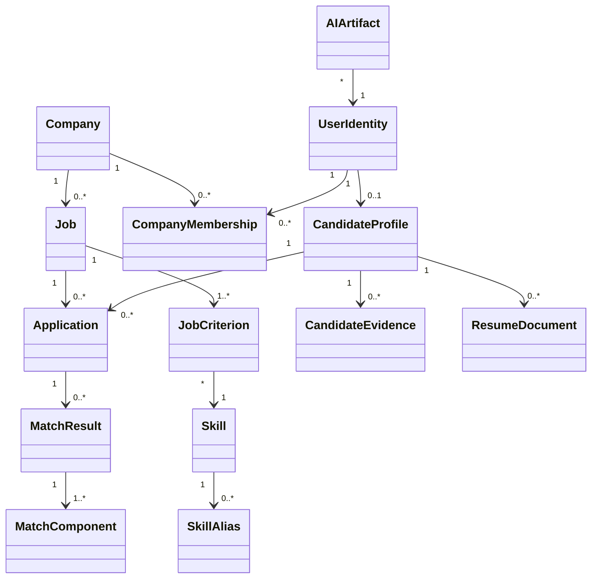
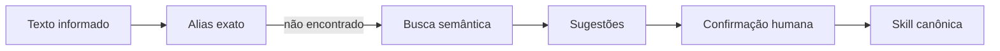

# VenturaHR 2.0 — Arquitetura Alvo

> Documento vivo de arquitetura. Objetivo: transformar o VenturaHR legado em uma plataforma de recrutamento e inteligência de talentos multiplataforma, explicável e preparada para IA.

## 1. Visão de produto

O VenturaHR 2.0 não será apenas um portal de vagas. Ele será uma plataforma que conecta **vagas, critérios, skills, evidências e candidatos**, preservando o PMD como componente determinístico e acrescentando inteligência semântica e IA para reduzir trabalho manual.

### Princípios

1. **IA assiste; humano decide.**
2. **Matching deve ser explicável.**
3. **Regras objetivas não podem ser substituídas por opinião de modelo generativo.**
4. **Nenhum segredo deve existir no cliente Flutter/Web.**
5. **Domínio não depende de Firebase, Flutter ou fornecedor de IA.**
6. **Web é plataforma de primeira classe.**
7. **Mobile e Web compartilham domínio e casos de uso.**
8. **Dados sensíveis e decisões de emprego exigem auditoria, minimização e controle de acesso.**

---

## 2. Arquitetura lógica



---

## 3. Estratégia de repositório

Não mover o legado imediatamente. A estrutura futura recomendada dentro do mesmo repositório é:

```text
VenturaHR/
├── docs/
│   ├── VENTURAHR_2.0_AUDIT.md
│   ├── VENTURAHR_2.0_ARCHITECTURE.md
│   └── VENTURAHR_2.0_BACKLOG.md
│
├── ventura_rh/                 # legado preservado inicialmente
│
├── apps/
│   └── ventura_hr/             # novo Flutter V2
│
├── packages/
│   └── ventura_domain/         # Dart puro: entidades, VOs e regras
│
└── services/
    └── ventura_api/            # backend/API e orquestração de IA
```

A criação dessas pastas de código acontecerá apenas na fase Foundation.

---

## 4. Arquitetura do Flutter V2

### 4.1 Feature-first + Clean boundaries

```text
lib/
├── app/
│   ├── app.dart
│   ├── router/
│   └── theme/
│
├── core/
│   ├── auth/
│   ├── errors/
│   ├── http/
│   ├── telemetry/
│   └── ui/
│
└── features/
    ├── auth/
    ├── companies/
    ├── candidates/
    ├── jobs/
    ├── applications/
    ├── matching/
    └── ai_assistant/
```

Dentro de cada feature:

```text
feature/
├── domain/
├── application/
├── data/
└── presentation/
```

### 4.2 Estado

Preferência arquitetural: **Riverpod** para estado e injeção de dependências, mantendo entidades independentes do framework.

Motivos:
- dependências explícitas;
- melhor testabilidade;
- composição por feature;
- reduz uso de service locator global;
- substitui `ChangeNotifier` dentro do domínio.

### 4.3 Navegação

Usar roteamento declarativo com suporte a:

- URLs navegáveis;
- deep links;
- browser back/forward;
- guards de autenticação e papel;
- páginas de vaga compartilháveis por link.

### 4.4 Responsividade

Três experiências, não apenas “celular/tablet”:

- **Compact:** smartphone;
- **Medium:** tablet/janelas menores;
- **Expanded:** desktop/Web.

No Web, painéis como recrutamento e comparação de candidatos devem aproveitar múltiplas colunas e navegação lateral.

---

## 5. Domínio V2

### 5.1 Entidades principais



### 5.2 JobCriterion

O critério original evolui para algo conceitualmente semelhante a:

```text
JobCriterion
- id
- skillId
- title
- description
- pmd: 1..5
- weight: 1..5
- required: bool
- minimumYearsExperience?
- evidencePolicy?
- source: human | ai_suggested | imported
- order
```

A IA pode **sugerir**, mas publicação/alteração relevante deve ser confirmada pelo recrutador.

---

## 6. Matching Engine 2.0

### 6.1 Não substituir o PMD

O PMD continua como componente determinístico.

```text
criterionScore = candidateLevel × weight
jobBaseline    = pmd × weight
```

O motor passa a combinar múltiplas evidências, mas cada parcela permanece inspecionável.

### 6.2 Componentes propostos

```text
MatchResult
├── Rule Score / PMD
├── Required Criteria Gate
├── Skill Evidence Score
├── Experience Relevance
├── Semantic Similarity
└── Confidence / Data Completeness
```

Os pesos definitivos serão configuráveis e versionados. Nenhum peso de exemplo será tratado como verdade universal.

### 6.3 Resultado explicável

Exemplo conceitual:

```text
Match: 84%

Atendidos
✓ Flutter — evidência: 4 anos + projeto recente
✓ Dart — evidência: experiência profissional
✓ APIs REST — evidência: 3 posições

Parcial
△ Firebase — experiência encontrada, mas abaixo do nível desejado

Gap
✕ Kubernetes — nenhuma evidência confirmada

Critérios obrigatórios: 4/5
Dados confirmados pelo candidato: 82%
Algoritmo: matching-v2.1
```

### 6.4 IA não deve produzir o placar sozinha

LLMs devem ser usados principalmente para:

- extração de evidência;
- classificação/normalização de skills;
- sumarização;
- explicações em linguagem natural;
- sugestão de critérios;
- preparação de entrevista.

O placar deve ser calculado por regras versionadas sobre dados estruturados e evidências rastreáveis.

---

## 7. Skill Graph

Um dos ativos mais importantes da V2 será a camada de skills.

```text
Skill: javascript
Aliases:
- JS
- Java Script
- ECMAScript

Relacionamentos:
- TypeScript -> related_to JavaScript
- Node.js -> ecosystem_of JavaScript
- React -> uses JavaScript
```

Isso resolve um problema original do VenturaHR: critérios semanticamente iguais ou relacionados não devem virar entidades completamente desconectadas por diferenças de escrita.

### Pipeline de normalização



---

## 8. IA — módulos

### AI-01 — Job Builder

Entrada natural:

> “Preciso de Flutter pleno, Firebase, REST e Git, com cerca de três anos de experiência.”

Saída estruturada:

- cargo/senioridade;
- descrição sugerida;
- skills canônicas;
- critérios sugeridos;
- PMD/peso sugeridos;
- itens obrigatórios sugeridos.

Tudo revisável antes da publicação.

### AI-02 — Resume Parser

```text
PDF/DOCX
  ↓
extração textual
  ↓
experiência / skills / formação / idiomas / certificações
  ↓
normalização para Skill Graph
  ↓
proposta de perfil estruturado
  ↓
confirmação do candidato
```

O currículo original continua como documento; o dado extraído guarda proveniência.

### AI-03 — Recruiter Copilot

Consultas permitidas sobre dados aos quais o recrutador tem acesso:

- “compare estes candidatos”;
- “quais requisitos obrigatórios faltam?”;
- “resuma evidências de Flutter deste candidato”;
- “sugira perguntas de entrevista sobre os gaps”.

### AI-04 — Candidate Copilot

- explicar matching;
- apontar gaps;
- recomendar quais dados faltam completar;
- comparar requisitos de vagas;
- orientar preparação profissional sem falsificar experiência.

### AI-05 — Semantic Search

Busca por intenção/skill além de título literal, preservando filtros objetivos como localização, modalidade, senioridade e datas.

---

## 9. Backend e Firebase

### Estratégia pragmática

Não migrar o banco imediatamente apenas por modernização.

**Fase inicial:** Firebase pode continuar fornecendo Auth, Storage e Firestore se os dados existentes forem recuperáveis e as regras forem adequadas.

Entretanto, o cliente não deve mais conhecer a persistência como regra de domínio.

```text
Domain Repository
       ↑
Application Use Case
       ↑
Firebase Adapter  OR  REST Adapter
```

Assim, uma futura migração para PostgreSQL ou arquitetura híbrida não exige reescrever o app inteiro.

### O que obrigatoriamente fica no servidor

- segredos;
- chamadas privilegiadas de IA;
- normalização global de skills;
- cálculo oficial/versionado de matching;
- geração de embeddings;
- jobs assíncronos de processamento de currículo;
- auditoria administrativa;
- e-mails/eventos de fechamento de vaga;
- operações que dependam de privilégios elevados.

---

## 10. Segurança e governança de IA

Como o VenturaHR atua em emprego/recrutamento, a V2 deve nascer com controles explícitos.

### Regras arquiteturais

- não utilizar atributos sensíveis para pontuação de contratação;
- não inferir atributos sensíveis a partir de currículo/foto/texto;
- não permitir que um LLM rejeite automaticamente uma pessoa;
- registrar versão do algoritmo e componentes do score;
- guardar evidências que explicam cada componente;
- permitir correção de dado extraído por IA;
- limitar acesso por empresa/membership;
- aplicar retenção e exclusão de dados;
- registrar ações administrativas relevantes;
- tratar prompts/respostas de IA como dados potencialmente sensíveis.

### AIArtifact

Toda saída de IA relevante deverá possuir metadados como:

```text
- id
- purpose
- subjectId
- inputRefs
- model/provider
- createdAt
- promptVersion
- outputStructured
- confidence?
- reviewedBy?
- reviewedAt?
- accepted/rejected/edited
```

Isso dá rastreabilidade sem transformar o modelo generativo na fonte de verdade.

---

## 11. Eventos de domínio

Preparar o backend para eventos permite automações sem acoplar tudo.

Exemplos:

```text
JobPublished
ApplicationSubmitted
ResumeUploaded
ResumeParsed
CandidateProfileUpdated
MatchCalculated
JobDeadlineReached
JobClosed
```

Consumidores futuros podem executar:

- matching;
- e-mail;
- notificações;
- analytics;
- reindexação semântica;
- auditoria.

---

## 12. Observabilidade

Desde M1:

- logs estruturados sem senha/token;
- correlation/request id;
- erros de frontend e backend;
- métricas de API;
- latência/custo de operações de IA;
- contagem de tokens por finalidade/tenant quando aplicável;
- taxa de aceitação/edição das sugestões de IA;
- métricas separadas de algoritmo determinístico e IA.

---

## 13. Decisões iniciais

| Tema | Decisão inicial |
|---|---|
| Estratégia | Migração incremental / strangler |
| Legado | Preservado inicialmente em `ventura_rh/` |
| Flutter | Novo shell moderno, null-safe, Web-first |
| Estado | Riverpod recomendado |
| Rotas | Declarativas + deep links |
| Domínio | Dart puro |
| Persistência | Repository abstraction |
| Firebase | Pode ser mantido inicialmente via adapters |
| IA | Somente via orquestração controlada/servidor para funções privilegiadas |
| Matching | Híbrido, explicável, versão do algoritmo |
| PMD | Preservado e evoluído |
| Skills | Entidade canônica + aliases + relações |
| Testes | Domínio primeiro, depois integração/UI |

---

## 14. Primeira vertical slice

A primeira implementação não será um “app inteiro”. Será um fluxo ponta a ponta pequeno:

```text
Recrutador autentica
      ↓
Cria vaga
      ↓
Adiciona 3 critérios
      ↓
Publica
      ↓
Candidato visualiza no Web
      ↓
Candidato responde critérios
      ↓
Backend calcula PMD Match
      ↓
Ambos veem explicação
```

Sem IA nesse primeiro slice. Quando esse núcleo estiver testado, adicionamos **Job Builder AI** e **normalização de skills** como primeiras capacidades inteligentes.

---

## 15. Critério para introduzir IA

IA entra quando estas condições estiverem atendidas:

- domínio e IDs canônicos definidos;
- autorização funcionando;
- matching determinístico testado;
- auditoria básica disponível;
- backend seguro para credenciais;
- schema de evidências definido;
- Web funcional.

Isso evita colocar IA sobre uma base inconsistente e depois depender dela para corrigir problemas de modelagem.
